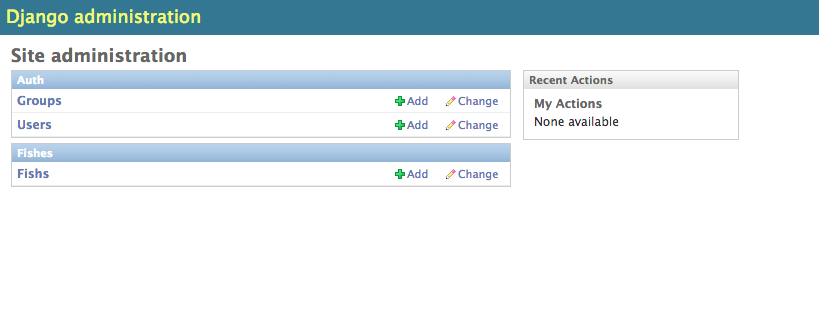

# Building simple REST API for mobile applications
## What is REST?
Representational State Transfer (REST) is lightweight, HTTP based and runs on web servers much like 'normal' web sites.  Instead of delivering in HTML, which is a combination of presentation and data, data is displayed with minimum formatting using separators and delimiters (like JSON). It can be thought of as an architectural style for designing networked applications or as a way of delivering web services.  REST is browsable, so helps developers modify and check the correctness of their code as only the data is displayed in the browser.  It is a safer method of providing services or data access as it does not expose much unnecessary surface area of the database used by the website.  Some well-known REST apis are from [Twitter](https://dev.twitter.com/rest/public)  and [Facebook Graph](https://developers.facebook.com/docs/graph-api).

REST is platform and language independent.  You could write a REST API with any languages that are typically associated with website creation such as PHP, Python or Ruby. There are four commonly defined methods used in REST architecture. These are the _create_, _read_, _update_ and _delete_ (CRUD) methods.  It is also possible to add more specialized methods such as retrieving the top ten most popular items or the highscore of all users. This could be achieved by writing a new method or using a query parameter such as `/api/items?top=10`.

## HTTP Methods and API endpoints
You might remember from creating web forms (synchronous) or ajax request (asynchronous) calls that you used GET and POST requests.  The PUT and DELETE requests are less used. If you then wrote an application in  PHP, Python or other language to process form data, you have written your own simple REST framework. POST, GET, PUT and DELETE correspond to create, read, update and delete and relate to basic database operations. API endpoints describe available operations on data exposed by the service.  Think of them as urls that provide data (GET request) or an url where you can submit data to (POST request). Many data formats could be used but the more common are JSON and XML. GET _/api/boats/123456_ will return data on the boat with an id of 123456 even when applied multiple times.

## Using djangorestframework to build a simple REST api
We will be using Django (Python MVC framework) and _djangorestframework_.  Djangorestframework is built using django (python) specifically for exposing data via the REST framework.

To begin, you will need to have Python v2.7 or later and Django 1.7.4 or later installed.  If you do not, install [Python](http://www.python.org/download/) and [Django](https://www.djangoproject.com/download/) now.

You can test your installation by firing up the command line and typing the `python` command. All being well you should see version information. Continue by typing:

```bash
>>> import django
>>> print(django.get_version())
1.7.4
```

This verifies that you have Django installed on your system.  Next, we build the Django project:

```bash
$ django-admin.py startproject marine
```

This is the list of files and folders created.

```bash
marine/
    manage.py
    marine/
        __init__.py
        settings.py
        urls.py
        wsgi.py
```

You can check if everything works as expected by executing:

```bash
$ python manage.py runserver
```

Which starts the Django development webserver for testing.  When successful, you will see:

```bash
Performing system checks...

0 errors found
February 15, 2015 - 15:50:53
Django version 1.7.4, using settings 'mysite.settings'
Starting development server at http://127.0.0.1:8000/
Quit the server with CONTROL-C.
```

If you open the URL [http://127.0.0.1:8000/](http://127.0.0.1:8000/) you will see a placeholder website.

Now we have a bare skeleton of the site. Next we will build an app (a container) which houses a model (as in Model-View-Controller).  A model is the source of data for your app.

Typing:

```
$ python manage.py startapp fishes
```

Will result in the following files

```bash
fishes/
    __init__.py
    admin.py
    migrations/
        __init__.py
    models.py
    tests.py
    views.py
```

Inside the `models.py` file, there is the import line `from django.db import models`.  Add the following code to it.

```python
    class Fish(models.Model):
        name = models.CharField(max_length=255)
        created = models.DateTimeField('auto_now_add=True')
        active = models.BooleanField()
```

This creates a class that exposes the name, created date of the fish and if the data row is active or not.  You can change the field type by referring [to the relevant documentation](https://docs.djangoproject.com/en/1.7/ref/models/fields/#field-types).

Now add the fishes app to the `marine/settings.py` file to register it.  Do this by under `INSTALLED_APPS`, adding `fishes` to the list. Run `python manage.py sql fishes` to see a preview of the database schema SQL that will run when we activate the app.  

```sql
    BEGIN;
        CREATE TABLE "fishes_fish" (
            "id" integer NOT NULL PRIMARY KEY,
            "name" varchar(255) NOT NULL,
            "created" datetime NOT NULL,
            "active" bool NOT NULL
        )
    ;

    COMMIT;
```

To confirm creating the relevant tables in the default sqlite database, type `python manage.py migrate` or `python manage.py syncdb` on older Django versions. Django will create authentication tables by default and the empty `fishes_fish` table in a sqlite3 database. The prompt will ask if you want to create a superuser as this is the first time you have run Django.

If for some reason you do not get prompted to create a superuser, at the command prompt, type:

```bash
$ python manage.py createsuperuser
```

Follow the instructions to create an administrator's account. Django provides a built-in admin page that lets you insert and modify data. The feature needs to be activated by editing the `admin.py` file inside the `fishes` folder.  Add the following code after `from django.contrib import admin`

```python
    ...
    from fishes.models import Fish
    admin.site.register(Fish)
```

We will use the account we created to log into the admin page.  Start the development server:

```bash
$ python manage.py runserver
```

Open _127.0.0.1:8000/admin_ and enter the superuser id and password.  You should see a admin page with the `Marine` list.  Click on `Fishes` to add or modify data.  Add some data.



Up to this point, we have built a working, but plain Django website. We will now incorporate the `djangorestframework` to the site by [downloading and installing it](http://www.django-rest-framework.org/#installation). One key thing to remember is to add `rest_framework` to the `INSTALLED_APPS` list in `marine/settings.py` and change `urls.py` to

```python
from django.contrib import admin
from rest_framework import routers
from fishes import views

router = routers.DefaultRouter()
#makes sure that the API endpoints work
router.register(r'api/fishes', views.FishViewSet)
admin.autodiscover()

urlpatterns = patterns('',
    # Examples:
    # url(r'^$', 'marine.views.home', name='home'),
    # url(r'^blog/', include('blog.urls')),

    url(r'^admin/', include(admin.site.urls)),
    url(r'^', include(router.urls)),
    url(r'^api-auth/', include('rest_framework.urls', namespace='rest_framework'))
)
```

This code switches on API routing which is crucial to the `djangorestframework and uses regular expression to set the valid URLs of the site.

When we installed `djangorestframework`, it gave us the ability to use serializers, which flattens the data obtained from the fish model into a string format, either XML or JSON.  To create a serializer for the fishes model, we create a file under the `fishes` folder and call it `serializers.py`.  Here are the contents of that file:

```python
from fishes.models import Fish
from rest_framework import serializers

class FishSerializer(serializers.HyperlinkedModelSerializer):
    class Meta:
        model = Fish
        fields = ('name', 'active', 'created')
```

In the `views.py` file, add:

```python
from rest_framework import viewsets
from rest_framework import permissions
from fishes.models import Fish
from fishes.serializers import FishSerializer

# Create your views here.
class FishViewSet(viewsets.ModelViewSet):
    # this fetches all the rows of data in the Fish table
    queryset = Fish.objects.all()
    serializer_class = FishSerializer
```

Now if you open _[http://127.0.0.1:8000/api/fishes/](http://127.0.0.1:8000/api/fishes/)_ you will see the browsable API.

```javascript
HTTP 200 OK
Content-Type: application/json
Vary: Accept
Allow: GET, POST, HEAD, OPTIONS

[
    {
        "name": "Dory",
        "created": "2014-06-21T04:23:01.639Z",
    },
    {
        "name": "Angel",
        "created": "2014-07-21T04:23:01.639Z",
    },
    {
        "name": "Clown",
        "created": "2014-08-21T04:23:01.639Z",
    }
]
```

You can find the source code for the [REST API app on GitHub](https://github.com/sitepoint-editors/simple-api-mobile "REST API"). There is no data so you will need to run `python manage.py migrate` or `python manage.py syncdb` on older Django versions after downloading.

## The iOS mobile app
Next we will go through the key steps required to create a mobile app that receives data from the API. We are using the `UITableView` to display our data in a list.  In XCode 6.3.1 (the latest version as of writing), create a new project

_File > New > Project > iOS Application > Single View Application_
- **Product Name**: Fishes
- **Language**: Objective-C
- **Devices**: iPhone (default was Universal, this includes both the iPhone and iPad)
- Not using Core Data for now.

Select a location to save your project and click _Create_. We will work on the files contained the _Fishes_ folder.

By default, the project has a View Controller. We want to show the data from the REST API as a list, so will use a `Table View Controller` instead. Create a new set of Objective-C files (_File > New > File > iOS Source > Cocoa Touch Class_).
- **Class**: `TableViewController`
- **Subclass of**: `UITableViewController`
- We do not need a XIB file

Save these new files in the _Fishes_ folder.

Open _Main.storyboard_, go to the [Object library](https://developer.apple.com/library/ios/recipes/xcode_help-IB_objects_media/Chapters/AddingObject.html "Object library") and drag the `Table View Controller` object to the storyboard.  Select and delete the default `View Controller`.  Make sure that in the [Inspector](https://developer.apple.com/library/mac/recipes/xcode_help-general/Chapters/AbouttheUtilityArea.html "Attributes Inspector"), the checkbox for _Is Initial View Controller_ for the selected `Table View Controller` is ticked.


- In _Main.storyboard_, expand the `Table View Controller` to expose `Table View Cell`, select the _Attributes Inspector_ and enter `FishCell` as the _Identifier_. This links the cells in the Interface Builder storyboard to the code.
- Change the `Style` to _Subtitle_ from _Basic_.  This allows us to display the value set by `cell.detailTextLabel`.
- Select `Table View Controller` under the `Table View Controller Scene`, click on the Identity Inspector and enter `TableViewController` into _Custom Class > Class_. This links the entire scene to the _TableViewController.m_ file.


Next, we add code that will make this app do something. The code demonstrates the use of a simple `NSArray` to display data hardcoded in the _TableViewController.m_. Replace any existing functions with the below.

```objectivec
- (NSInteger)numberOfSectionsInTableView:(UITableView *)tableView {
#warning Potentially incomplete method implementation.
    // Return the number of sections.
    return 1;
}
- (NSInteger)tableView:(UITableView *)tableView numberOfRowsInSection:(NSInteger)section {
#warning Incomplete method implementation.
    // Return the number of rows in the section.  I currently have three rows we would like to show
    return 3;
}

- (UITableViewCell *)tableView:(UITableView *)tableView cellForRowAtIndexPath:(NSIndexPath *)indexPath {
    UITableViewCell *cell = [tableView dequeueReusableCellWithIdentifier:@"FishCell" forIndexPath:indexPath];
    //temporary data to demonstrate the structure of a NSDictionary in an NSArray, which is the general structure of a JSON, this can be removed in a later stage
    NSArray *fishes = @[
                        @{@"name": @"Dory", @"created": @"2014-06-21T04:23:01.639Z"},
                        @{@"name": @"Angel", @"created": @"2014-07-21T04:23:01.639Z"},
                        @{@"name": @"Clown", @"created": @"2014-08-21T04:23:01.639Z"}
                        ];
    if (cell == nil) {
        cell = [[UITableViewCell alloc] initWithStyle:UITableViewCellStyleDefault reuseIdentifier:@"FishCell"];
    }
    //We will replace fishes with fishJson once we have code that downloads from the REST api
    [cell.textLabel setText:[[fishes objectAtIndex:indexPath.row] objectForKey:@"name"] ];
    [cell.detailTextLabel setText:[[fishes objectAtIndex:indexPath.row] objectForKey:@"created"]];
    return cell;
}
```

Now, we can test this simple application. Select _Product > Run_.

Next we need to obtain JSON from the REST api we published using the `djangorestframework`. We established a `NSArray` object called `fishJson` by registering it at the`@interface`level and synthesizing it with`@property`and`@synthesize`.  This replaces the code for the setters and getters.  We then replace the code we had in the`numberOfRowsInSection`, where we replace `fishes` with `fishJson` that contains the JSON from the REST API. Again replace any existing functions or declarations.

```objectivec
@interface TableViewController ()
@property (strong) NSArray *fishJson;
@end

@implementation TableViewController
@synthesize fishJson;
- (void) downloadData {
    //I use NSMutableString so we could append or replace parts of the URI with query parameters in the future
    NSMutableString *remoteUrl = [NSMutableString stringWithFormat:@"http://127.0.0.1:8000/api/fishes/?format=%@", @"json"];
    NSURLRequest *request = [NSURLRequest requestWithURL:[NSURL URLWithString:remoteUrl] ];
    NSError *jsonError = nil;
    NSHTTPURLResponse *jsonResponse = nil;

    NSData *response;
    do {
        response = [NSURLConnection sendSynchronousRequest:request returningResponse:&jsonResponse error:&jsonError];
    } while ([jsonError domain] == NSURLErrorDomain);

    if([jsonResponse statusCode] != 200) {
        NSLog(@"%ld", (long)[jsonResponse statusCode]);
    } else {
        NSLog(@"%@", @"200 OK");
    }
    NSError* error;
    if(response) {
        //fishJson was defined earlier near the top as a NSArray object
        fishJson = [NSJSONSerialization
                JSONObjectWithData:response
                options:kNilOptions
                error:&error];
    }
}
```

We need to ensure this method runs when the app starts, add the following below `viewDidLoad`:

```
[self downloadData];
```

Here we update the `numberOfRowsInSection` method.  This code ensures that the number of rows matches the number of elements contained in the `fishJson` array.

```objectivec
- (NSInteger)tableView:(UITableView *)tableView numberOfRowsInSection:(NSInteger)section {
#warning Incomplete method implementation.
    // Return the number of rows in the section.
    return [fishJson count];
}
```

Update the `cellForRowAtIndexPath` method so it loads entries from our REST feed:

```
- (UITableViewCell *)tableView:(UITableView *)tableView cellForRowAtIndexPath:(NSIndexPath *)indexPath {
    UITableViewCell *cell = [tableView dequeueReusableCellWithIdentifier:@"FishCell" forIndexPath:indexPath];

    // Configure the cell...
    if (cell == nil) {
        cell = [[UITableViewCell alloc] initWithStyle:UITableViewCellStyleDefault reuseIdentifier:@"FishCell"];
    }
    [cell.textLabel setText:[[fishJson objectAtIndex:indexPath.row] objectForKey:@"name"] ];
    [cell.detailTextLabel setText:[[fishJson objectAtIndex:indexPath.row] objectForKey:@"created"]];
    return cell;
}
```

Now we have a working simple mobile app to display data obtained from an online or local REST API. You can find the code for the iOS app in the same repository above. This tutorial contained a lot of concepts and components which is typical of 'real world' apps. If you experienced any issues or have any questions or comments, please let me know in teh comments below.
