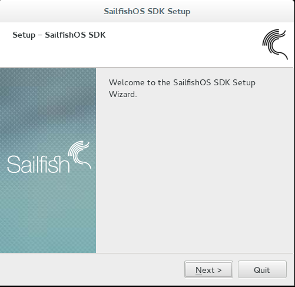
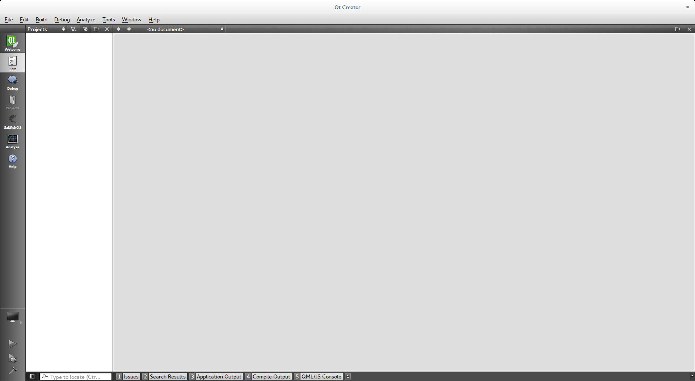
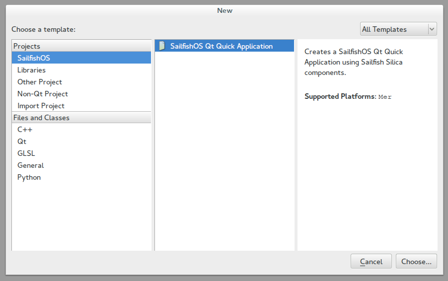
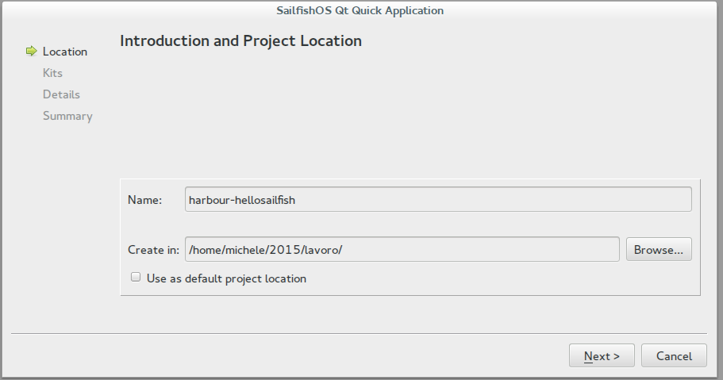
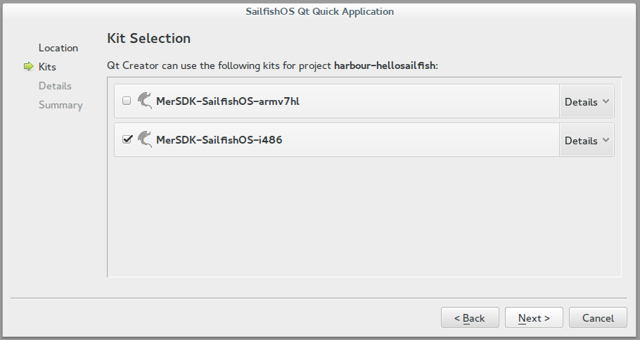
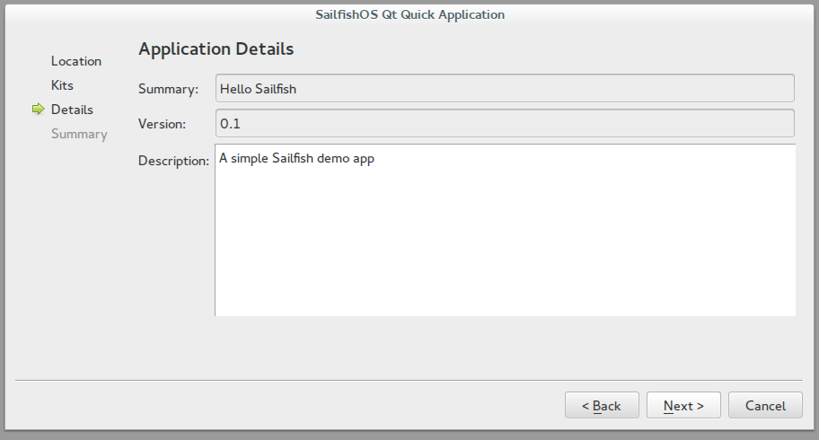
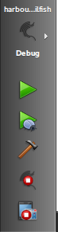
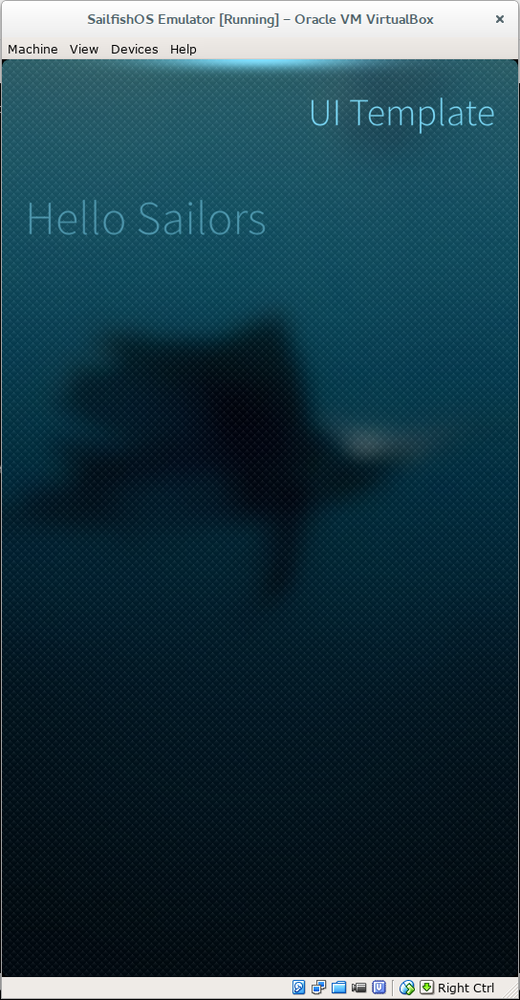
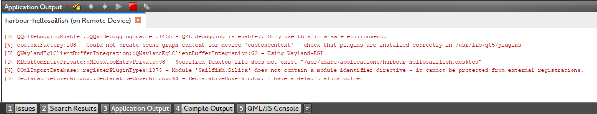

# Hello Sailfish, an introduction to developing for SailfishOS

After [Jolla](https://jolla.com/) won the last [Mobile World Congress best tablet awards](https://identi.ca/jolla/image/gmyTYW_UTGW-uO4kiIObTw), interest in their operating system [SailfishOS](https://sailfishos.org/) has rocketed.

Sailfish is a modern and secure operating system built on top of the [Mer open source project](http://merproject.org/) so it's like a classic Linux distribution with the great addition of the Jolla crafted Sailfish UI. There's no buttons on Sailfish devices, everything is handled with simple gestures, supported by an appealing design style. It's a really interesting platform, for both users and developers. In this article I'll show you how easy it is to develop on this new and promising platform.

## Developer environment set up
The SDK is based on the QT Creator development environment and a series of tools are available to build and test applications. It contains the Mer build engine for cross compilation, an Emulator and all the API documentation. Sailfish SDK is supported on Linux, OS X and Windows, so you have no excuse to not give it a try.

You need to install [VirtualBox](http://www.virtualbox.org/) and then download the SDK for your platform available [here](https://sailfishos.org/develop/).
You can find detailed install instructions for each platform [here](https://sailfishos.org/develop/sdk-overview/develop-installation-article/), but everything should be straightforward.  

Double click on the installer file and click "Next" a couple of times.



The installation comes with everything pre-configured, so once you launch the Sailfish IDE you are ready to start.



## Creating a project
After Qt creator has finished loading, click on _File > New File_ or Project and select _Applications > SailfishOS_ Qt Quick Application.



Fill in your project name and choose the directory where it will be saved. If you plan to submit the application to the Jolla Harbour (this is the name of the Jolla developer portal), you should use a name like "harbour-myApplicationName".

This will become the package name when the app is ready to ship.



Click next and select both "MerSDK-SailfishOS-armv7hl" and "MerSDK-SailfishOS-i486". The first is for you to build the Jolla Phone, the second for the emulator.



Continue clicking next and fill in the project summary and description.



Finally click next and choose if you want to add the project to git for version control.

The project is now ready. The entry point of the app will be _src/yourappname.cpp_:

## Coding time

It's time to look at the example project that the SDK had created. Open the file _src/yourappname.cpp_

```
int main(int argc, char *argv[])
	{
		return SailfishApp::main(argc, argv);
	}

```

This is the only strictly necessary C++ code you have to include in the application. It will create a `QGuiApplication` and a `QQuickView` instance and loads the main QML file, named as your target name.

Sailfish UI uses QML language, a JavaScript-based, declarative language for designing user interface–centric applications. It is part of the QT Framework.

Open the QML file named _qml/yourappname.qml_:

```javascript

import QtQuick 2.0
import Sailfish.Silica 1.0
import "pages"
```

The first two lines will import the Qt Quick And Sailfish Silica modules, so we can use the basic "widgets" (this is not the proper name in the QML context) provided by the OS.

The last import loads all the QML file in the pages sub directory, and they will be made available in the current QML file.

```javascript
ApplicationWindow
{
    initialPage: Component { FirstPage { } }
    cover: Qt.resolvedUrl("cover/CoverPage.qml")
}
```

The Application Window is the top-level element of all Sailfish Silica apps. It sets up the initial page to show when the app starts and also defines the Cover to be displayed when app is pushed in the background.

QML Objects are specified by their type, followed by a pair of braces. Object types always begin with a capital letter. A list of the basic QML Elements can be found [here](http://qt.apidoc.info/4.8.5/qmlbasicelements.html) and the Sailfish specific element, called Silica components, is listed in the SDK documentation (_Help > Contents > Sailfish Silica Reference Documentation_)

The _qml/pages/FirstPage.qml_ file contains a single Page to be displayed:

```javascript
Page {
    id: page
```

The Page object is a simple container. It's possible to define the id property with the name of our choice, and then use it every time it's needed to refer to the specific object.

It can be defined for all the QML objects.

```javascript
    SilicaFlickable {
        anchors.fill: parent
```

The first child of the Page element is a `SilicaFlickable`. This is an element that places its children on a surface that can be dragged and flicked. You can use [anchors](http://doc.qt.io/qt-5/qtquick-positioning-anchors.html) to align and place the elements in relation to each other. The flickable is needed here in order to use the next element, a pulley menu, one of the key elements in the Sailfish UI. A pulley menu is an extension of a page, it can be placed at the top or bottom and it is revealed when user moves the content, freeing the user from the need to reach the top or the bottom of the screen to select a menu item.

Adding a pulley menu is straightforward:

```javascript
        PullDownMenu {
            MenuItem {
                text: qsTr("Show Page 2")
                onClicked: pageStack.push(Qt.resolvedUrl("SecondPage.qml"))
            }
        }
```

A pulley menu always needs to be a child of a flickable element ( `SilicaFlickable`, `SilicaListView`, or `SilicaGridView` ). Defining multiple menu items is possible but guidelines suggest you not exceed five elements.

In the code above, an action is attached to the `onClicked` event, using the pageStack object to push _SecondPage.qml_ into view.

```javascript
	Column {
            id: column

            width: page.width
            spacing: Theme.paddingLarge
            PageHeader {
                title: "UI Template"
            }
            Label {
                x: Theme.paddingLarge
                text: "Hello Sailors"
                color: Theme.secondaryHighlightColor
                font.pixelSize: Theme.fontSizeExtraLarge
            }
		}
```

The `Column` element positions it's child vertically to avoid overlapping. The `PageHeader` elements define the title displayed on the top of the content and the Label, well it's just a label.

Notice how spacing, font size and color are defined using the Theme object. It's not necessary to hard code anything, and I will be confident that my app will scale well on multiple devices, and text will be easy to read on any ambiance users choose.

The Ambiances is a sort of "theme" in Sailfish but can also change the look of every application to match the colors and backgrounds selected by the user.

Now open the _qml/cover/CoverPage.qml_ file.

```javascript
CoverBackground {
    Label {
        id: label
        anchors.centerIn: parent
        text: "My Cover"
    }

    CoverActionList {
        id: coverAction

        CoverAction {
            iconSource: "image://theme/icon-cover-next"
        }

        CoverAction {
            iconSource: "image://theme/icon-cover-pause"
        }
}
```

Covers in Sailfish is the visual representations of background applications which are displayed on the screen of the running applications (similar to the Android task switcher). In this example the Cover displays a Label and provides two `coverAction`s that allow the user to interact with the application, even when it is in the background.

The `onTriggered` event is fired whenever a cover action is activated but is not used in this example.

## Run the app

Click now on the Sailfish (Debug) logo on the left sidebar, and choose the _"MerSDK-SailfishOS-i486"_ kit to choose to build and run the application on the emulator.



Press the green _play_ button to compile and run the project. The first time you'll be asked to start the Mer build machine and the emulator, click "Yes" and wait for the emulator to pop up and your app to start.



The "Application Output" tab will display all the logs from the app errors and  "console.log" messages.



## Summing Up

Now you have the tools and the knowledge needed to write a basic but pleasant looking Sailfish application. I found Sailfish SDK cleverer than the most of other mobile SDKs and the emulator runs smoothly, making development on this platform a real joy. I will discuss more about Silica UI components and their parallels with other mobile OS in future articles and I am interested to hear how you have found working with Sailfish.

Happy hacking.
