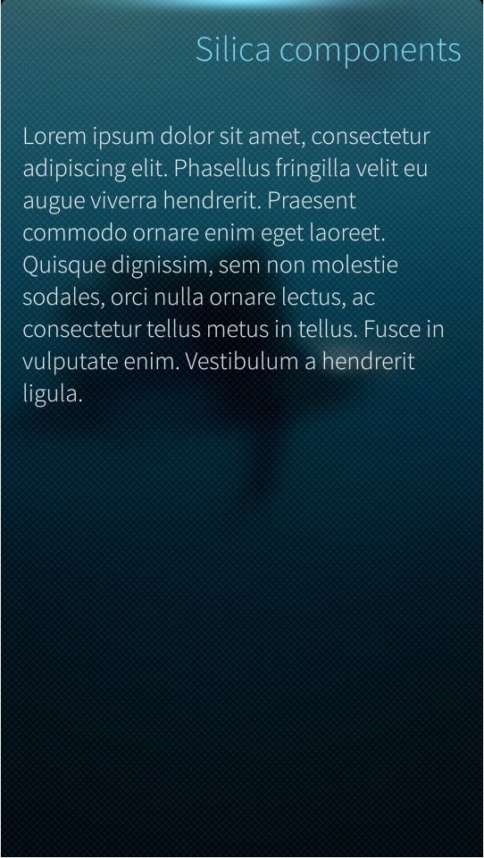
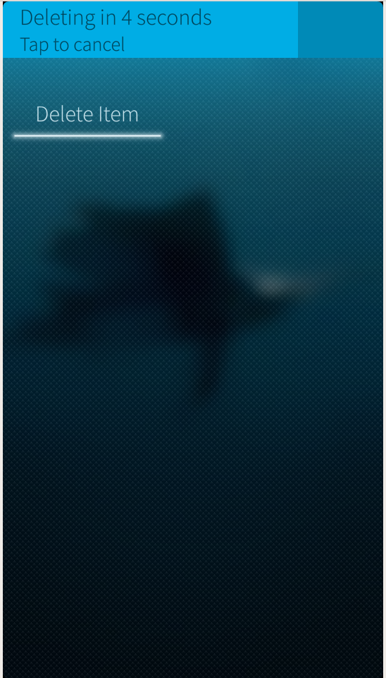
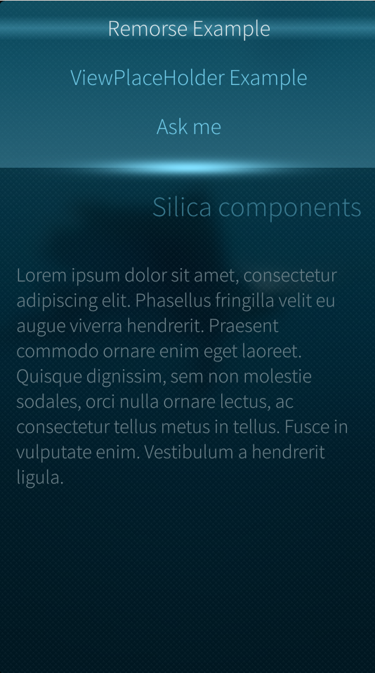

# Silica Components for Sailfish OS
The Sailfish UI is written using the QML declarative language that allows user interfaces to be described in terms of their visual components and how they interact and relate with each other.

It has a JSON-like syntax with support for Javascript expressions and dynamic property bindings. One of its key features is that it's highly readable and allows components to be reused and customized within a user interface.

With QML, creating performant, fluid and appealing applications is simple and the `QtQuick` module provides the basic components to start.

The Sailfish SDK includes Sailfish Silica, an extension QML module, providing additional types designed for use by Sailfish applications.

When writing Sailfish applications with QML, you will need to make use of both the Sailfish Silica and QtQuick modules. You should use Silica whenever possible, as these components have a Sailfish look and feel, behave consistently with standard Sailfish applications and enable apps to make use of unique Sailfish features, such as pulley menus and application covers.

In this article I will describe the most common components, how to use them and when.

## Basic Components
QTQuick provides the basic object types an app will need, such as `Image`, `Rectangle`, `Circle`, `Item`, and `ListView`. A Complete list can be found [here](http://doc.qt.io/qt-5/qtquick-qmlmodule.html).

Any of these can be used in Sailfish applications, but you should use the right Silica components when available (SilicaListView vs ListView, SilicaGridView vs GridView etc. ) as they have the Sailfish look and feel.

To use these components just add:

```javascript
import QtQuick 2.0
```

And in the QML file add:

```javascript
import Sailfish.Silica 1.0
```

to start using Silica components.

## Theme
Now let's discuss the Silica components. The `Theme` object provides common style information like colors, fonts and margins. Colors will match the ambiance selected by the user.

Let's start with an example:

```javascript
Text {
    color: Theme.primaryColor
    font.family: Theme.fontFamily
    font.pixelSize: Theme.fontSizeMedium
}
```

A Text element is a read-only formatted text view. Here I defined the three most common property for text, using the relative Theme's property. The Theme object define a set of property for sizes, colors, and fonts:

Two standard fonts are used in the Sailfish UI:
- `Theme.fontFamily` - the default font, used for label, button etc
- `Theme.fontFamilyHeading` - used to display heading text. Titles, pages headers etc.

The font pixel size is defined by this properties:
- `Theme.fontSizeExtraSmall`
- `Theme.fontSizeSmall`
- `Theme.fontSizeMedium`
- `Theme.fontSizeLarge`
- `Theme.fontSizeExtraLarge`

And the color values:
- `Theme.primaryColor` - used for Labels
- `Theme.secondaryColor` - used for less prominent parts of the UI
- `Theme.highlightColor` - used for active and selected areas of the UI
- `Theme.secondaryHighlightColor` - a less prominent highlight color

In the Silica module, a Label component is available, and it should be used in preference to the Text element as it makes use of the properties above.

Finally the Theme object exposes all the standard item size and padding values:
- `itemSizeSmall` - small item size, for example used in one-line list items
- `itemSizeMedium` - medium item size, for example used in two-line list items
- `itemSizeLarge` - large item size used in complex list items, used in items with some content to preview
- `itemSizeExtraLarge` - extra large item size, one fourth of the portrait width, used in list header grids
- `paddingSmall` - small padding, commonly used between labels close together
- `paddingMedium` - medium padding, common margin within UI components
- `paddingLarge` - large padding, commonly used as page margin close to the display borders

Use these wherever possible, so the application will look coherent to the platform look and feel.

## Page and PageStack
A `Page` defines an individual screen of content to which the user may navigate from within the app. It's usually sized to the full width and height of the screen for the current orientation. It may be resized due to orientation changes or the input panel displayed.

To ensure that the content is scrollable if the page is too small, put everything in a `SilicaFlickable`.

If you need to display a page title use the `PageHeader` type which is made for this use.

An example:



```javascript
import QtQuick 2.0
import Sailfish.Silica 1.0

Page {
    SilicaFlickable {
        contentHeight: column.height
        anchors.fill: parent

        VerticalScrollDecorator {}

        Column {
            spacing: Theme.paddingLarge
            id: column
            width: parent.width

            PageHeader {
                title: "Silica components"
                id: header

            }

            Label {
                text: "Lorem ipsum dolor sit amet, consectetur adipiscing elit. Phasellus fringilla velit eu augue viverra hendrerit. Praesent commodo ornare enim eget laoreet. Quisque dignissim, sem non molestie sodales, orci nulla ornare lectus, ac consectetur tellus metus in tellus. Fusce in vulputate enim. Vestibulum a hendrerit ligula."
                font.pixelSize: Theme.fontSizeSmall
                wrapMode: Text.Wrap

                anchors {
                            left: parent.left
                            right: parent.right
                            margins: Theme.paddingLarge
                        }
            }

        }
    }
}
```

Above I defined a `Page` that contains just one child, a `SilicaFlickable` to ensure that if the content will be too long to fit, it will be scrollable. I added a `VerticalScrollDecorator` to give visual feedback to the user while scrolling.

Following this, a `Column` and `QtQuick` components are used to vertically position a series of items without using anchors. I used the `Theme` object to set the spacing property.

I used the `PageHeader` type to display the page title and finally created a `Label`, with some text and a property to display it as I wish.

Pages are handled with a stack-based navigation model provided by the `PageStack` type. Our `ApplicationWindow` (the top-level component of a Sailfish application) has a property called `pageStack` that holds an instance of this, always displaying the top-most page in its page stack.

A page may be pushed (the `push()` method) onto the stack to place it at the top of the stack, or popped (the `pop()` method) to remove it.

With this model it's simple to provide hierarchical navigation within an application where gestures and standard buttons allow the user to navigate back and forth


In the image above you can see that the indicators in the top-left (or top-right) margins of a page stack indicate whether the page can be swiped back or forward. Navigation gestures can be invoked pragmatically, via the `navigateBack()` and `navigateForward()` functions.

As an example, if I add this code as a child of the `Column` object:

```javascript

        Button {
            text: "next page"
            onClicked: pageStack.push("MyPage.qml")
        }

        Button {
            text: "previous page"
            onClicked: pageStack.pop()

        }
```

where `MyPage.qml` is the name of the page itself and the user can navigate through more instances of the same page, back and forth.

## Cover
Active covers is one of the distinctive elements of Sailfish. It's the visual representation of an application running in the background and it will be visible on the Home screen.

It can be used to display real time information to the user (like the currently playing song) and to provide one or two cover actions that can be triggered directly without the need to open the application (eg. Pause, skip song).

The `ApplicationWindow` holds the instance of the Cover that can be created using a top-level element, the `CoverBackground` type:


```javascript

import QtQuick 2.0
import Sailfish.Silica 1.0

CoverBackground {

    Image {
        id:background
        fillMode: Image.PreserveAspectCrop
        source: "landscape.png"
    }

    Label {
        anchors.centerIn: parent
        id: label
        width: parent.width
        horizontalAlignment: Text.AlignHCenter
        text: "Hello cover"
    }


    CoverActionList {
        id: coverAction

        CoverAction {
            iconSource: "image://theme/icon-cover-new"
            onTriggered: addItem()
        }

    }

    function addItem() {
        console.log("Adding item")
    }

}
```

In this example I created a `CoverBackground` object and added an Image as its child that will be used as a background and will fill the entire cover,  preserving the image aspect ratio.

I added a centered label and a `CoverActionList` with one `CoverAction`.

`CoverAction` specifies the action to take when a cover gesture is activated. It's defined with an icon and a function to be triggered at the right time. Sailfish only handles two `CoverAction`s for a cover. You can see how javascipt-like functions and syntax can be used in QML to declare functions and using them as a callback for events.

## RemorsePopup and RemorseItem
Another interesting element in the Sailfish UI toolkit is the `RemorsePopup`.

This allows destructive options to be performed after a _remorse_ period has elapsed. Users change their mind, or hit the wrong button, so providing them an option to cancel a destructive action is always good, especially on touch devices.



The user can tap the æ before the timeout and cancel the destructive action.

Adding a `RemorsePopup` is easy. If I have a "delete" Button:

```javascript

Button {
   text: "Delete Item"
   onClicked: deleteItem()
}
```

Leaving the `deleteItem` method, I can just change the code like this:

```javascript
Button {
   id: button
   text: "Delete Item"
   onClicked: remorse.execute("Deleting",  deleteItem )
   RemorsePopup { id: remorse }

}
```

When a user clicks the button, the `RemorsePopup` will be displayed with the specified text.

Once the timeout has expired or the `RemorsePopup` is clicked, the `deleteItem` callback will be called.

The `RemorseItem` type works in the same way, but can be attached to an object (like a list element) where it will become a sibling to its target parent.

## Pulley Menu
In Sailfish menus are usually represented as a Pulley menu. It is positioned above/under the content of the view and is accessed by dragging the view down/up. The menu items are activated by either:
- Dragging the view down/up to highlight a menu item and releasing to activate.
- Dragging or flicking to expose the entire menu, and tapping a menu item to activate.

Pulley menus should be added to a `SilicaFlickable`, `SilicaListView`, `SilicaGridView` or `SilicaWebView` to work.

The `PullDownMenu` is used to create a pulley menu, and it will be populated by declaring `MenuItem` objects as its children.



```javascript
import QtQuick 2.0
import Sailfish.Silica 1.0

Page {
        SilicaListView {
            PullDownMenu {
                MenuItem {
                    text: "Option 1"
                    onClicked: console.log("Clicked option 1")
                }
                MenuItem {
                    text: "Option 2"
                    onClicked: console.log("Clicked option 2")
                }
            }
            header: PageHeader { title: "Header" }
            delegate: MyListItem {}
            model: MyModel {}
        }
    }
```

## ViewPlaceholder
Another handy component is the `ViewPlaceholder`. It provides placeholder text to be displayed in empty views when no content is available.

In this way the user will be aware that the app is ready but that there is nothing to show.

If the view has a `PullDownMenu`, tapping the `ViewPlaceholder` will show the menu to indicate to the user that options may be available.

```javascript
Page {
    SilicaListView {
        id: view
        anchors.fill: parent
        model: ListModel { }

        ViewPlaceholder {
            enabled: view.count == 0
            text: "Nothing to show now"
        }

        delegate: BackgroundItem {
            width: view.width
            Label { text: "Item " + index }
        }
    }
}
```

In this example I added a `ViewPlaceholder` to a `SilicaListView` and binded its enabled property to the `count` property of list itself.

As soon as we add something to the list model our `ViewPlaceholder` will disappear.

## Dialog
`Dialog` is a generic container for displaying a dialog that accepts user input. It will show as a modal dialog box added to the top of a `PageStack`. The user can accept a dialog (confirming modifications, or input and proceed) pushing the page from right to left, or tapping the Accept Button. Conversely, dialog is rejected by pushing the page from left to right or tapping the Cancel Button.

A simple dialog is created in this way:


```javascript
import QtQuick 2.0
import Sailfish.Silica 1.0

Dialog {
    property string name

    Column {
        width: parent.width

        DialogHeader { }
        TextField {
            id: nameField
            width: 480
            placeholderText: "What's your name?"
        }
    }

    onDone: {
        if (result == DialogResult.Accepted) {
            name = nameField.text
        }
    }
}
```

The `onDone` event will be triggered when the user accept or dismisses the dialog. The `DialogResult.Accepted` holds the user intention.

`DialogHeader` should be used to provide page indicators at the top of the dialog page.

The Dialog can be displayed pushing it to the `pageStack` as a normal Page.

```javascript
Column {
    Label {
        id: displayedName
    }

    Button {
        text: "Ask me"
        onClicked: {
            var dialog = pageStack.push("NameInputDialog.qml", {"name": displayedName.text})
            dialog.accepted.connect(function() {
                displayedName.text = "My name: " + dialog.name
            })
        }
    }
}
```

Above I connected the signal "accepted" of the dialog to a javascript function that updated the label, using the `name` property of the Dialog (set when the dialog is accepted).

If the dialog is rejected, the `onRejected` signal handler is called and the result is set to `DialogResult.Rejected`.

## Conclusion
This is a brief introduction to the most popular Silica components that are important to understand and use correctly to create a native application with the Sailfish look and feel. I will be covering more components in more detail in future articles. In the meantime enjoy Sailfish and I would love to know your opinions..
