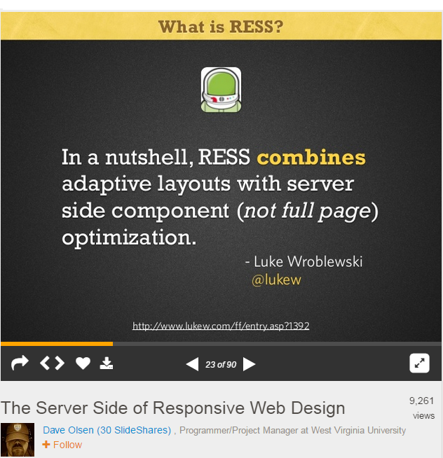

#RESS: Responsive Design + Server Side Components introduction + resources

The skills to create responsive designs are essential to any credible web designer.  With more and more people using small screen devices (smart phones, tablets, note books etc) to browse their favorite websites, blogs and social networking websites, a one size fits all design created for desktop and laptop computers can no longer be adequate.

Further, responsive design solves many problems: 

- One code base, one deployment One URL
- Responsive design is Future Friendly
- Less work for the designer. With responsive design your content is available on all devices, you don't need to create and manage separate mobile website for small screen devices. One URL also avoids duplicate content which can hurt SEO
- A bounty of free tools and frameworks  available to create responsive websites.

##Responsive design is not problem free: 
Responsive web design does not solve all problems. High resolution images are enjoying greating popularity with the advent of retina displays and loading high-resolution images. Such images can eat up quite a bit of bandwidth. You can use HTML and CSS to resize your images but this won't necessarily fix the problem. Fluid images are not best solution. A 2 MB JPEG is still a 2 MB JPEG, even if it's crammed down into a 120-pixel-wide column.

A large 2MB image  may not make a lot of difference when browsing on your desktop over a fast broadband network,  but it can make for an achingly slow website when surfing over slow mobile network on a mobile phone. To prevent this you need to provide low resolution images. 

##What is RESS: Responsive Design + Server Side Components

Image Source: [SlideShare](http://www.slideshare.net/dmolsenwvu/the-server-side-of-responsive-web-design)

RESS can help you to optimize your content for small and large screen devices. You don't need to create a separate website for small screen devices. You can use server side swapping to display different content. For example, differently sized images for different sized screens. 

In 2011 Luke Wroblewski published an article [RESS: Responsive Design + Server Side Components](http://www.lukew.com/ff/entry.asp?1392),  in which he explained the concept of RESS: Responsive Design + Server Side Components in detail. Here is an excerpt from Luke's article about RESS.

### How's RESS: Responsive Design + Server Side Components Work?

>	Let's assume we want a different navigation solution for mobile and desktop devices. Because screens are small on mobile, we want a minimal header that doesn't take space away from content. But we need to allow people to navigate the site in a comfortable way so we'll position the navigation links at the bottom of the page where accessing them tends to be easier with one-handed use.

>	On the desktop, however, we want the same navigation at the top of the page. There's plenty of room for the content and we can expose all our menu choices to give people a sense of what's on the site. You can see the difference between these two navigation designs below.

> [RESS: Responsive Design + Server Side Components by Luke](http://www.lukew.com/ff/entry.asp?1392 "RESS: Responsive Design + Server Side Components")

 One important question that you can ask, is  the RESS approach really effective? Luke also answered this question in his article, Luke actually  used this device specific components in the implementation of his start-up, Bagcheck blog.

In the above case their server side components took care of optimized rendering for specific devices. Luke believes that Relying on user agent detection on the server to decide which device class specific components to include could be an issue for some. Because  there was  a lot of debate about how accurate [User Agent Detection](http://www.w3.org/TR/2001/NOTE-cuap-20010206) is.

## Getting started tutorials and tools

If you want to learn more about RESS and how to get started with RESS (Responsive Design + Server Side Components) here is a list of some helpful tutorials and resources:

** [RESS: Responsive Design + Server Side Components](http://www.lukew.com/ff/entry.asp?1392)**

**[Getting started with RESS](http://www.creativebloq.com/responsive-web-design/getting-started-ress-5122956)**
(Basic knowledge of PHP and Responsive design is required).

**[Lightening Your Responsive Website Design With RESS](http://www.smashingmagazine.com/2013/10/08/responsive-website-design-with-ress)** Tutorial 

**[Improve Mobile Support With Server-Side-Enhanced Responsive Design](http://www.smashingmagazine.com/2013/04/09/improve-mobile-support-with-server-side-enhanced-responsive-design/)** Case Study
	
### Tools

**[RESS.io](http://ress.io/)** is a tool for elite web designers &amp; developers to implement RESS easily and effectively, based on Lukew's Responsive Design with Server Side components model. To learn more about visit [getting started](http://ress.io/get-started/) page.

**[Detector](https://github.com/dmolsen/Detector)** is a simple, PHP- and JavaScript-based browser- and feature-detection library that can adapt to new devices &amp; browsers on its own without the need to pull from a central database of browser information. You can visit [Github page](https://github.com/dmolsen/Detector) to see demo and learn more about Detector.
