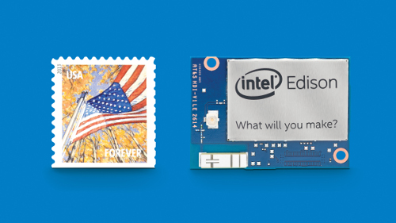

## Intel Edison, an introduction

### Introduction
While mobile devices as smartphones are becoming bigger and bigger at every model update, there's a new wave of really small devices, like smartwatches and more in general wearables, that are hitting the market right now.

Meanwhile the maker movement grown a lot in the last few year, with Arduino leading the prototyping hardware market.
In this landscape last year Intel introduced a device that is appealing for makers but ready for IoT and wearables products, the Intel Edison.

Edison is small sized compute module capable of running a full linux distribution and intended to empower the next generation of wearables and the Internet of Things (IoT) devices, where size and power consumption are important factor to consider.

So let's have a look at this platform, I'll describe the main hardware features and most important for SitePoint users, what possibilities it offer for developer.
The kind of projects realizable with such a platform are up to the devs fantasy, to say as Intel does, "What you will make"?
### Hardware

Intel Edison is a really small board, slightly larger than a SD card (35.5 × 25.0 × 3.9 mm) featuring a dual-core dual-threaded Intel® Atom™ CPU at 500 MHz and a 32-bit Intel® Quark™ microcontroller at 100 MHz.

On the memory side we found 1GB of RAM and  4GB of flash storage. Obviously on board  WiFi and Bluetooth are present.
It also has 1 USB OTG controller and all the interfaces that a maker can dream on: UART, I2C, SPI, I2S, GPIO and SD Card support.

Impressive for its dimension.

### Breakout board

Edison comes in a package with a 70 pin connector, quite difficult to use directly. For easy prototyping Intel has expressly made available to developers two breakout board.

The _Intel Edison Board for Arduino_ and the _Intel Edison Breakout Board_ are officially supported by Intel.
They have quite different purpose, size and IO capability.

### Intel Edison Board for Arduino

This board is the largest and interfaces rich board avoidable. It feature I/O pins compatible with Arduino Uno (except 4 PWM instead of 6 PWM), 20 digital input/output pins (including 4 pins as PWM outputs).
Also it offer 6 analog inputs, UART (Rx/Tx), I2C,  ICSP 6-pin header (SPI) and a Micro USB or a dedicated standard size USB host Type-A connector.

The list not end here and we also found a micro USB device (connected to UART) and  a SD card connector.
It expose most of the capability of Edison, and can be the right base to build on any kind of project where you need may different type of interfaces or when you just need to experiment.

### Intel Edison Breakout Board

The breakout board is much smaller than the Arduino's one, slightly larger than the Edison module itself. The board has a minimal set of features: Exposes native 1.8 V I/O of the Edison module,  0.1 inch grid I/O array of through-hole solder points, USB OTG with USB Micro Type-AB connector and a USB OTG power switch. Also we find a Battery charger and a USB to device UART bridge with USB micro Type-B connector.

If this is enough for your projects you can save a lot of space.

### Software

Edison comes with a prebuilt Yocto Linux image, but it's capable to run your Linux distribution of choice. Yocto is a meta-distribution used by embedded developers to create tailored image to their needs.

Intel choose this OS so developers can just start using the default image, play with that, configure and customize it as they prefer and then prepare a custom image for the product once every things is ok, making this process as easy as possible using some simple commands provided by the Yocto project.

Having a full linux distribution on a device like this open a lot of possibilities, developer will be able to reuse the wide range of already available packages and libraries for linux, making development of a product much faster and simpler. Also they don't need to learn any new language, toolkit or use any SDK at all if they want, but just develop with standard GNU/Linux directly on the device! Ok, this can be quite slow but...

Obviously Intel offer some (actually many) tools to get developer started with Edison development, here I will talk about some of them.

#### Edison SDK
The (https://software.intel.com/en-us/iot/hardware/edison/downloads)[Intel Edison SDK] provide all the necessary tools to develop for the platform.

It's based on Eclipse (yes another instance of Eclipse on your pc) and it include the cross-compile tools, connector to deploy and debug your software on the board and the basic library and documentation a developer will need. Choose this if you plan to developer using  C++, but you can also use this environment even for other language as Javascript and Python.

#### Intel XDK IoT Edition
Intel has released a (https://software.intel.com/en-us/html5/xdk-iot)[IoT variant] of the XDK environment, covered in (http://www.sitepoint.com/?s=intel+xdk)[other articles here on SitePoint].

With this developers will be able to easily write javascript application (will be running on the Edison as Node.js apps) and test it on the device. Intel also made easy to develop HTML5 mobile companion app that can communicate with the board.

#### Arduino
Edison, with the Arduino breakout, it's able to run the Arduino's sketches. So with the right version of the (https://software.intel.com/en-us/iot/hardware/edison/downloads)[Arduino IDE] developers will be able to use the really wide range of libraries, examples and sketches already available. This, combined with the power of a full Linux distribution represent a  really powerful platform for expert and beginners devs.

#### Wyliodrin
With Wyliodrin you don't have to know a programming language. Early developers can program their boards using a visual & streams programming systems, just dragging and dropping blocks.

Wyliodrin will write the code for them, an option for who wants to start.

### Libraries

Intel it's really committed to make the developers experience as seamless as possible, and has released two useful library that abstract, the IO and a broad range of sensors, to allow developer to forget about the low level stuff and be committed to the user experience.

Both those library has binding for C++, Python and Javascript.

#### Lib MRAA
(http://iotdk.intel.com/docs/mraa/v0.6.0/)[Lib MRAA] C/C++ library (with bindings to JavaScript & python) to interface with the IO of Edison & other platforms.

If offer a structured and sane API and does not tie you to specific hardware because it offer  board detection done at runtime, so pin numbering will match the board currently in use. 

#### UPM
(https://github.com/intel-iot-devkit/upm)[UPM] is a high level repository for sensors that use libmraa.

UPM typically represent a sensor as a class, with the constructor used to initialize the sensor and parameters is used to provide pin location on the board. Those classes usually expose an update() function that will be called in order to get new data from the sensor.

### Summing up
Edison represent an interesting opportunity to anyone has a wearables/IoT ideas and want to experiment on a real, product ready platform.

A platform rich of features and that has a really low friction to get started as most of the developer can find a language that they already know.

With a cool set of feature, ready to use libraries and an open software platform ready to be hacked, Intel has made a great job in the aim to make things happen. 
